# Azure Active Directory - OAuth guide for app to app security


This guide will show you how to set up a client credentials oauth grant type for application to application security using Azure AD. 

For more information on the different OAuth grant types and the client credentials grant type in particular I'd recommend looking here: [https://alexbilbie.com/guide-to-oauth-2-grants/#client-credentials-grant--section-4](https://alexbilbie.com/guide-to-oauth-2-grants/#client-credentials-grant--section-44)


# 1.    Create the new application in Azure AD that needs to be secured

Within Azure AD click on App Registrations and then New Registration

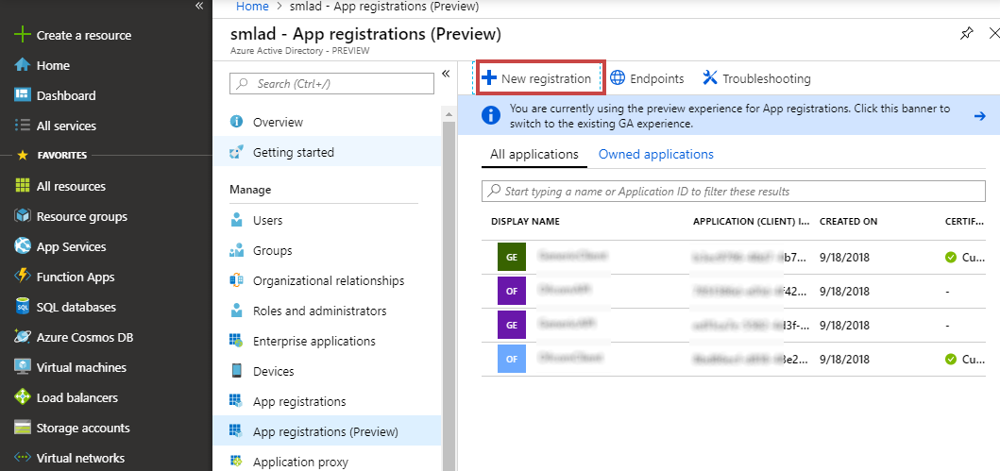 

Then enter a name for this new application, you do not need to enter a redirect URI for a client credentials grant type.  

For this demo I'm calling the application that we want to secure ```OAuthDemo-API```

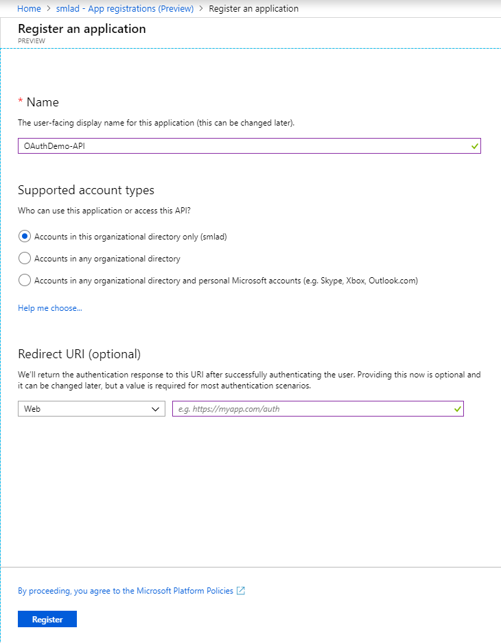 

# 2.    Create an application role

We can assign roles for this application which can be granted to any clients. Any granted roles will appear as claims. 

For more information on this please see: [https://docs.microsoft.com/en-us/azure/architecture/multitenant-identity/app-roles](https://docs.microsoft.com/en-us/azure/architecture/multitenant-identity/app-roles)

## 2.1   Editing the manifest

Open the Manifest and replace the ```"appRoles": [],``` line with the following code. For your version you can change the display names, descriptions and ID. 

```
"appRoles": [
    {
      "allowedMemberTypes": [
        "Application"
      ],
      "displayName": "OAuthDemo-API Read Only Role",
      "id": "8c0c9630-0fb9-4394-953e-1cc24129c818",
      "isEnabled": true,
      "description": "Read-only access to our Demo API",
      "value": "OAuthDemoAPI.ReadOnly"
    }
  ],
```
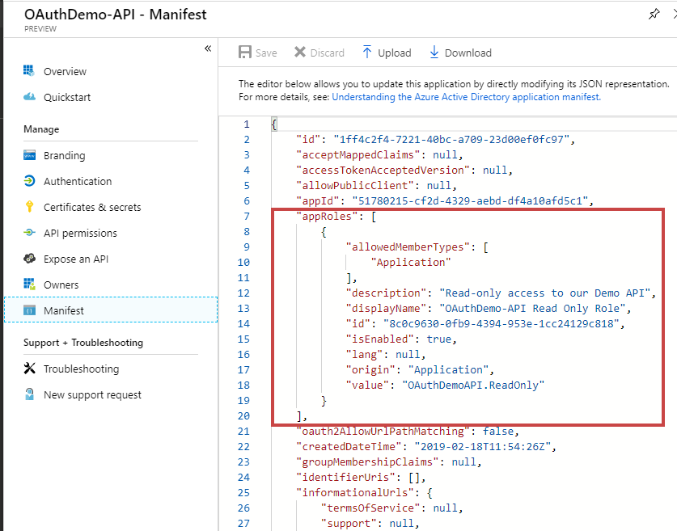 


Finally, save the changes

# 3.    Client Applications

Each client application that wants access to the application we are securing need to be created separately. 

We could then grant each client application different roles, for example Read Only access or write access. 

## 3.1   Create a new Application for our Client App

Folling the same process as the first application, we need to create a new application in AD for our client. Here i've named our client ```OAuthDemo-Client```

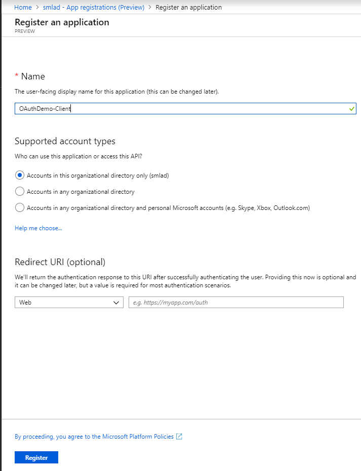 


## 3.2 Assigning Roles to Clients

When we create the ```OAuthDemo-API``` application we added a role to the manifest with the value ```OAuthDemoAPI.ReadOnly```

We are now going to assign this role to our new application, so that it will appear within our JWT token

Click on **API permissions** and then **Add a permission**

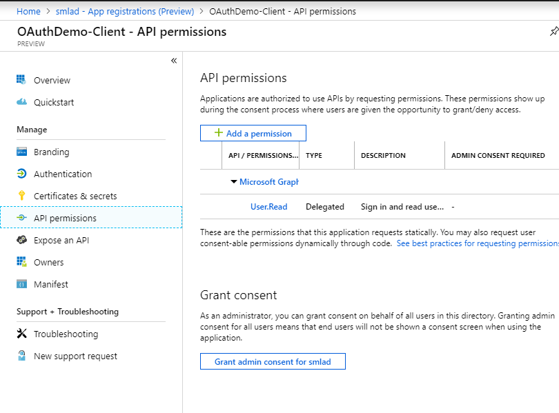 


Choose **My APIs** and click on the application we are securing. In our case its the ```OAuthDemo-API```

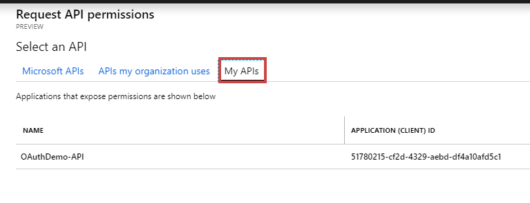 

Check the check box with the role we created in step 2.1, in our case ```OAuthDemoAPI.ReadOnly```

Then click Add Permissions at the bottom

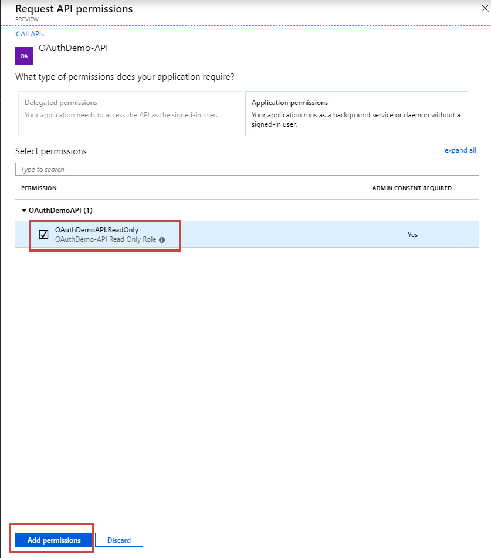 

Next click the button called ```Grant admin consent for {your AD name will be here}```

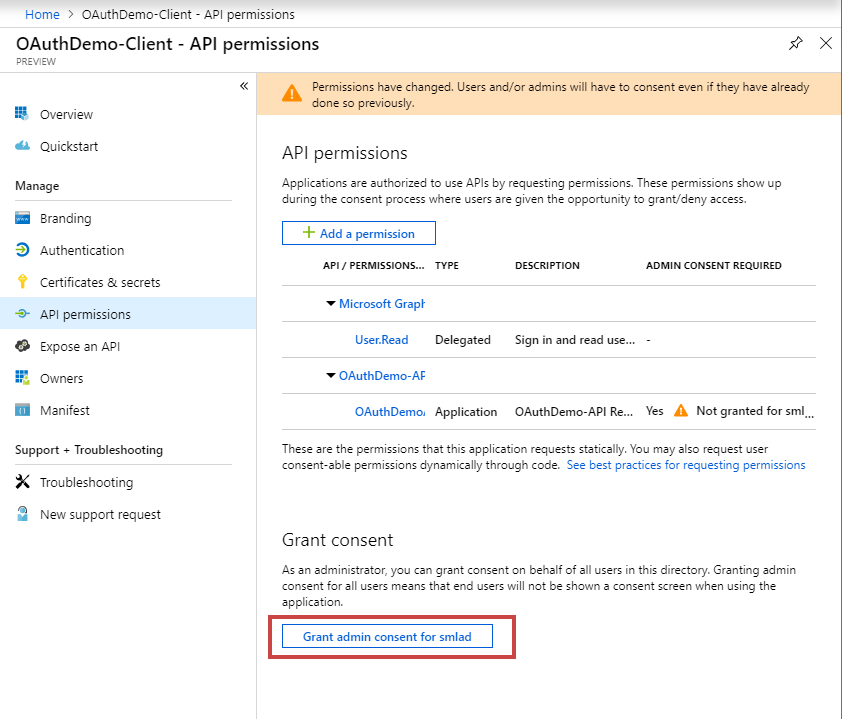 

# 4. Create a Client Secret 

Next we need to create client secrets for our client application. Click on **Certifications & Secrets** and then **New Client Secret**

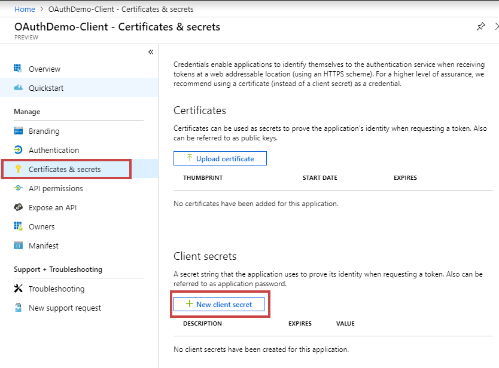 

Enter a description for the secret and choose when you would like it to auto expire. For our example we are never going to have it expire, but it is best practise to set expiry times and rotate these. 

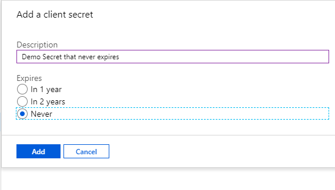 

Next copy the secrets value and save it somewhere as this will not be available to view after

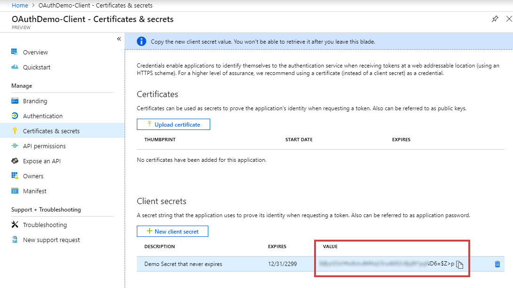 


# 5. Retreive all keys needed to make a token request

The request to Azure AD to get a OAuth token will look like this

```
POST /{AD_Tenant_ID}/oauth2/token HTTP/1.1
Host: login.microsoftonline.com
Content-Type: application/x-www-form-urlencoded

grant_type=client_credentials&client_id={CLIENT_ID}&client_secret={CLIENT_SECRET}&resource={APPID_URI}
```

So we need to find the values for:

1. AD_Tenant_ID 
2. CLIENT_ID 
3. CLIENT_SECRET
4. APPID_URI
	
## 5.1 Get AD Tenant ID

This is on the overiew page of your Azure AD in the portal as shown below

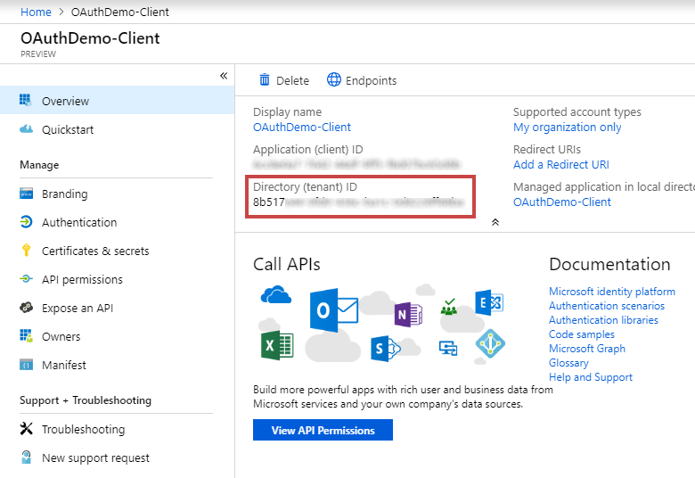 

## 5.2 Client ID

This is the Application (Client) ID for the client application we created in AD, which is located on the applications overview page

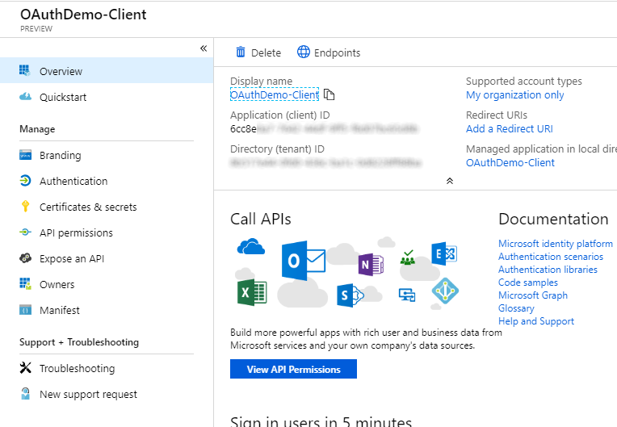 


## 5.3 Client Secret

This is the secret that we previously copied in step 4

 

## 5.4 APP ID URI


```
 <validate-jwt failed-validation-error-message="Unauthorized. Access token is missing or invalid." failed-validation-httpcode="401" header-name="Authorization">
            <openid-config url="https://login.microsoftonline.com/{tenant}/.well-known/openid-configuration" />
            <audiences>
                <audience>{APP ID URI}</audience>
            </audiences>
            <required-claims>
                <claim name="roles" match="all">
                    <value>{APPLICATION PERMISSION}</value>
                </claim>
            </required-claims>
</validate-jwt>
```